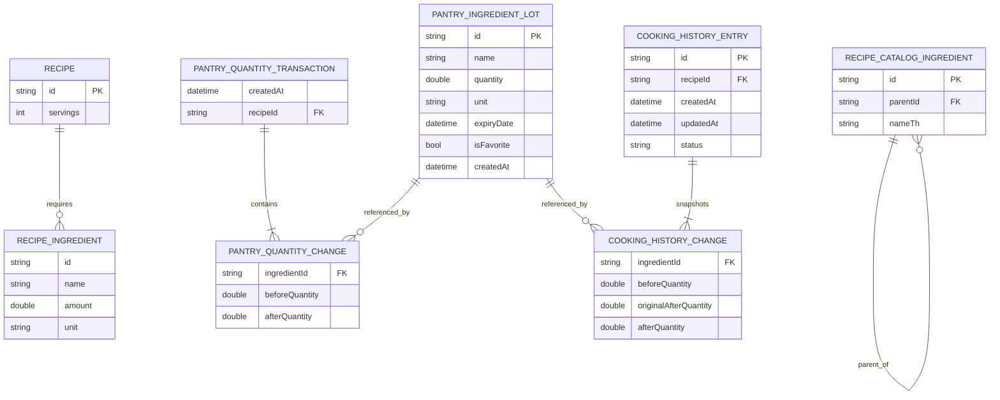

# KinRaiDee Data Model Review

- Audit date: 2026-07-26
- Application commit: `d8631869bb7e0eb18a9cc136189006212f8737dd`
- Shopping compatibility verdict: **NOT READY**

## Current entities

| Entity | Important fields | Current owner | Evidence |
|---|---|---|---|
| Pantry `Ingredient` | `id`, free-text `name`, `quantity`, free-text `unit`, `expiryDate`, `isFavorite`, `createdAt` | `core/models` | `apps/mobile/lib/core/models/ingredient.dart:1-91` |
| `FoodCategory` / `FoodItem` | category name/icon; item name/emoji/aliases | Pantry presentation catalogue | `apps/mobile/lib/features/pantry/domain/models/food_category.dart:1-38` and the category constants below line 40 |
| Recipe `Ingredient` | canonical `id`, Thai/English names, aliases, category, optional `parentId` | Recipe domain/catalogue | `apps/mobile/lib/features/recipe/domain/entities/ingredient.dart:1-51`; `assets/ingredients/thai_ingredients.json` |
| `RecipeIngredient` | `id`, display `name`, amount, unit, optional flag | Recipe domain | `apps/mobile/lib/features/recipe/domain/entities/recipe_ingredient.dart:1-28` |
| `Recipe` | recipe ID, names, image, servings, ingredients, steps, categories and metadata | Recipe domain | `apps/mobile/lib/features/recipe/domain/entities/recipe.dart` |
| `RecipeMatch` | recipe, missing and available requirements, match percentage | Recipe domain result | `apps/mobile/lib/features/recipe/domain/entities/recipe_match.dart` |
| `SmartRecommendation` | recipe match plus recommendation scores/reasons | Recipe domain result | `apps/mobile/lib/features/recipe/domain/entities/smart_recommendation.dart` |
| `PantryQuantityChange` | lot ID/name/unit, before and after quantity | Pantry domain transaction | `apps/mobile/lib/features/pantry/domain/models/pantry_quantity_transaction.dart:1-20` |
| `PantryQuantityTransaction` | recipe ID/name, servings, changes, `createdAt` | Pantry domain transaction | `apps/mobile/lib/features/pantry/domain/models/pantry_quantity_transaction.dart:22-38` |
| `CookingHistoryChange` | lot ID/name/unit, before, original-after, current-after quantities | Pantry/history domain | `apps/mobile/lib/features/pantry/domain/models/cooking_history_entry.dart:5-74` |
| `CookingHistoryEntry` | derived ID, recipe snapshot, original/current servings, original/current changes, timestamps, status | Pantry/history domain | `apps/mobile/lib/features/pantry/domain/models/cooking_history_entry.dart:76-195` |

The application contains 104 hard-coded `FoodItem` records and a separate 57-entry canonical recipe ingredient asset. The two catalogues are not joined by stable IDs.

## Relationships

Important limitations of the current relationship model:

- `RecipeIngredient.id` is not enforced as a foreign key to the 57-entry recipe ingredient asset.
- Pantry lot `Ingredient.id` identifies a physical record, not a canonical ingredient type.
- `PantryQuantityChange.ingredientId` and `CookingHistoryChange.ingredientId` reference a Pantry lot that may later be deleted.
- Recipe-to-Pantry matching is resolved by normalized display names and family aliases rather than a stored relationship (`ingredient_name_matcher.dart:3-56`).

## Ownership boundaries

| Data | Intended owner | Actual mutation owner | Assessment |
|---|---|---|---|
| Pantry lots | Pantry domain/repository | `PantryNotifier` in `core/providers` | Repository exists, but orchestration, UI events, navigation, and History coordination are mixed into the notifier. |
| Cooking History | Pantry/history domain/repository | Presentation `CookingHistoryNotifier`, plus `CookingHistoryPage` | No repository contract; direct `StorageService` access and page-level multi-store mutation. |
| Recipe catalogue | Recipe domain/repository | `LocalRecipeDataSource` through `RecipeRepository` | Clear ownership and read-only repository path. |
| Recipe favourites | Recipe preference state | Storage helpers called by providers | Stored in the Pantry box; no explicit preference repository. |
| Hero pin selections | Recipe presentation state | `HeroSelectionNotifier` | Presentation directly owns persistence. |
| Ingredient taxonomy | Shared domain concern | Recipe asset plus Pantry hard-coded list | Split ownership and incompatible identifiers. |
| Shopping entities | Not implemented | `ShoppingPage` placeholder only | No production model exists, which is appropriate until the open decisions are approved. |

## Persistence locations

| Data | Location | Shape and access | Evidence |
|---|---|---|---|
| Pantry lots | Hive `pantry_box`, key `ingredients` | Entire `List<Map>` rewritten on each mutation | `apps/mobile/lib/core/services/storage_service.dart:9-17,31-37,171-199` |
| Recipe favourites | Same Hive box, key `favoriteRecipeIds` | Set serialized as list | `storage_service.dart:39-59` |
| Hero pins | Same Hive box, key `pinnedHeroRecipeIds` | List of recipe IDs | `storage_service.dart:61-86` |
| Cooking History | Same Hive box, key `cookingHistory` | Entire `List<Map>` rewritten | `storage_service.dart:88-146` |
| Recipes | Nine bundled JSON assets | Read-only asset loading | `apps/mobile/lib/features/recipe/data/datasources/local_recipe_datasource.dart:8-45` |
| Recipe ingredient taxonomy | `assets/ingredients/thai_ingredients.json` | Read-only JSON catalogue | `apps/mobile/lib/features/recipe/data/ingredient_catalog.dart` |

There is no per-record schema version, migration registry, transaction journal, or persisted recovery marker.

## Mutation paths

| Mutation | Current path | Risk |
|---|---|---|
| Add/update/delete/favourite Pantry lot | Page -> `PantryNotifier` -> `PantryRepository` -> `StorageService` -> whole-list Hive write | State changes optimistically before durability; write failures are not represented to UI. |
| Complete cooking | `RecipeDetailPage._finishCooking` -> planner -> `PantryNotifier.applyQuantityTransaction` -> Pantry write -> History write | Two durable writes with no rollback, recovery, or idempotency key. |
| Quick undo | Snackbar -> `PantryNotifier.undoQuantityTransaction` -> conditional lot restores -> Pantry write -> optional History cancel | A multi-lot partial restore can persist while History remains completed. |
| Adjust/cancel History | `CookingHistoryPage._applyAdjustment` -> adjustment planner -> Pantry write -> History replace | Same non-atomic two-write sequence; page is the workflow owner. |
| Pin hero recipe | `HeroSelectionNotifier` -> `StorageService.savePinnedHeroRecipeIds` | Presentation bypasses repository boundary. |
| Load malformed Pantry/History | `StorageService` parses raw maps | Missing Pantry timestamps default to now; invalid records may be skipped, obscuring migration/data-loss events. |

## Migration risks

1. **One dynamic box contains unrelated schemas.** A change to Pantry, History, favourites, or hero selections shares the same lifecycle and lacks isolated migration ownership (`storage_service.dart:9-17`).
2. **Raw maps have permissive fallback parsing.** `StorageService.loadCookingHistory` catches malformed entries and omits them (`storage_service.dart:106-136`). Pantry parsing defaults a missing `createdAt` to the current time and skips invalid entries (`171-199`). Migration problems may look like user deletion or altered ordering.
3. **Identifiers encode implementation details.** History IDs are derived from `createdAt.microsecondsSinceEpoch` plus recipe ID (`cooking_history_entry.dart:194-195`). Pantry lot IDs are generated from current microseconds in `AddIngredientDialog._submit` (`add_ingredient_dialog.dart:97-108`). Neither is an explicit domain identity or idempotency key.
4. **Units are unbounded strings.** Quantity conversion is limited to the unit cases in `recipe_serving_calculator.dart`; Shopping aggregation cannot safely merge arbitrary spellings or incompatible dimensions.
5. **Names currently behave like foreign keys.** Updating aliases or Thai display text can change recipe availability and Shopping deduplication without a data migration.
6. **History snapshots outlive Pantry lots.** Deleting a lot leaves history change IDs pointing to a non-existent record; cancellation then depends on planner fallback behavior rather than a defined ownership rule.

## Missing identifiers and timestamps

| Missing or weak field | Current consequence | Shopping consequence |
|---|---|---|
| Canonical ingredient ID on Pantry lot | Pantry-to-recipe matching relies on names | Cannot deterministically merge shortages with existing Pantry or Shopping entries. |
| Distinct Pantry lot ID type | A generic string is passed across transaction and history models | Easy to confuse catalogue, recipe requirement, lot, and Shopping item IDs. |
| Explicit transaction ID | History ID is derived after the fact | Cannot guarantee idempotent completion, retry, undo, or cross-store recovery. |
| Transaction cause/source | Only recipe metadata and created time are stored | Shopping-to-Pantry, manual adjustment, cancel, undo, and cooking cannot share one auditable mutation model. |
| Transaction lifecycle/version | No pending/committed/failed marker | App restart between writes cannot recover deterministically. |
| `updatedAt` on Pantry lot | Edits cannot be ordered or conflict-checked | Shopping synchronization and stale-transaction protection lack a version signal. |
| Schema version on Pantry/History payloads | Parsing relies on optional-field defaults | Shopping migrations can silently reinterpret old local data. |
| Canonical unit/dimension ID | Units are free strings | Duplicate merge and shortage arithmetic can combine incompatible quantities. |
| Stable `FoodItem` ID | Pantry picker items are display-only | Catalogue selection cannot establish canonical identity. |

## Shopping compatibility assessment

**Verdict: NOT READY**

The current models can display a Shopping list, but they cannot safely support the Handbook's Shopping Foundation requirements:

- Duplicate detection is undefined because Pantry `FoodItem`, Pantry lots, recipe requirements, and the recipe ingredient asset do not share one identifier.
- Recipe-shortage generation cannot distinguish one canonical ingredient from multiple Pantry lots without name heuristics.
- Unit normalization is insufficient for deterministic aggregation.
- Shopping-to-Pantry transfer would require another multi-store transaction, while Pantry + History already lacks atomicity.
- Soft/hard delete, ordering, grouping, and lifecycle choices remain unresolved in `docs/04_Product_Specs/Shopping.md`.
- ADR-003 repository boundaries, ADR-004 transaction safety, and ADR-005 Shopping as a first-class domain remain proposed in `DECISIONS.md`.

## Recommended model changes

These are design recommendations only; none were implemented by this audit.

1. **Approve explicit identity types.** Define `IngredientId` for taxonomy identity, `PantryLotId` for stock records, `ShoppingItemId` for list entries, and `TransactionId` for mutations. Do not reuse display names as keys.
2. **Map both catalogues before adding Shopping.** Give every Pantry picker `FoodItem` a canonical ingredient ID and reconcile it with `thai_ingredients.json`, including parent/variant rules.
3. **Introduce a quantity value contract.** Store a canonical unit, dimension, and precision policy; keep display units as presentation metadata. Reject incompatible aggregation rather than guessing.
4. **Version mutable records.** Add explicit schema versions and deterministic migrations for Pantry, History, and future Shopping data. Migration failures must be observable and tested.
5. **Make transactions first-class.** Persist `transactionId`, cause, created time, status, and ordered changes. Define idempotent commit, compensation, and restart recovery semantics before Shopping-to-Pantry transfer.
6. **Add concurrency/precondition metadata.** Pantry lots need at least `updatedAt` or a revision so an old plan cannot overwrite a newer edit.
7. **Preserve historical snapshots deliberately.** History should retain display snapshots while referencing stable canonical and lot identities where available; deletion behavior must be explicit.
8. **Define the Shopping entity only after ADR approval.** At minimum, evaluate stable ID, canonical ingredient ID, display name, quantity/unit, source, checked/status, created/updated timestamps, ordering/grouping, and deletion metadata.
9. **Put ownership behind repositories.** Pantry, Cooking History, Shopping, and persisted recipe preferences need domain-owned contracts; presentation must not serialize or call Hive.
