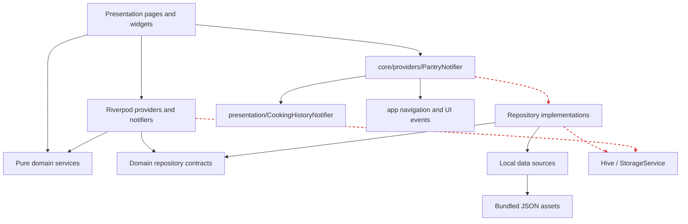
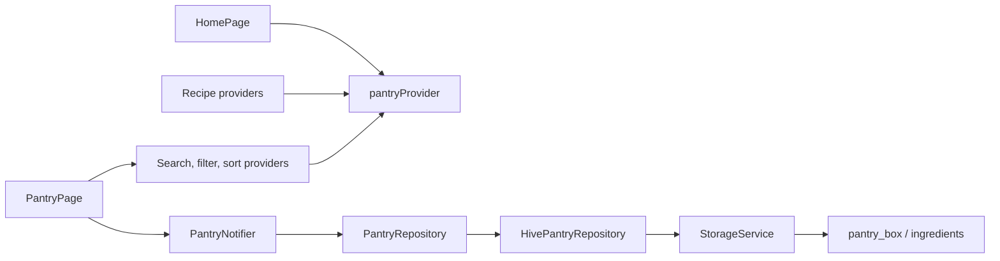
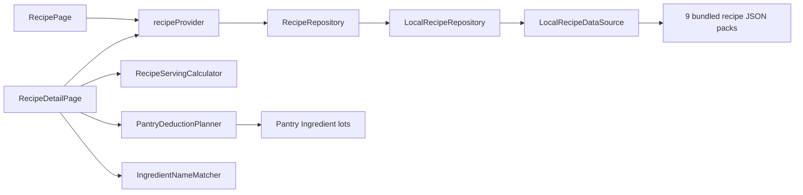
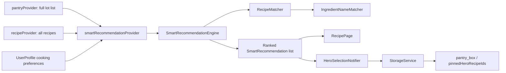
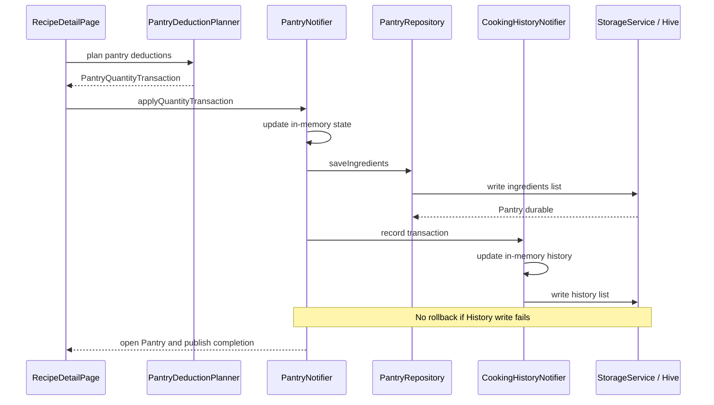
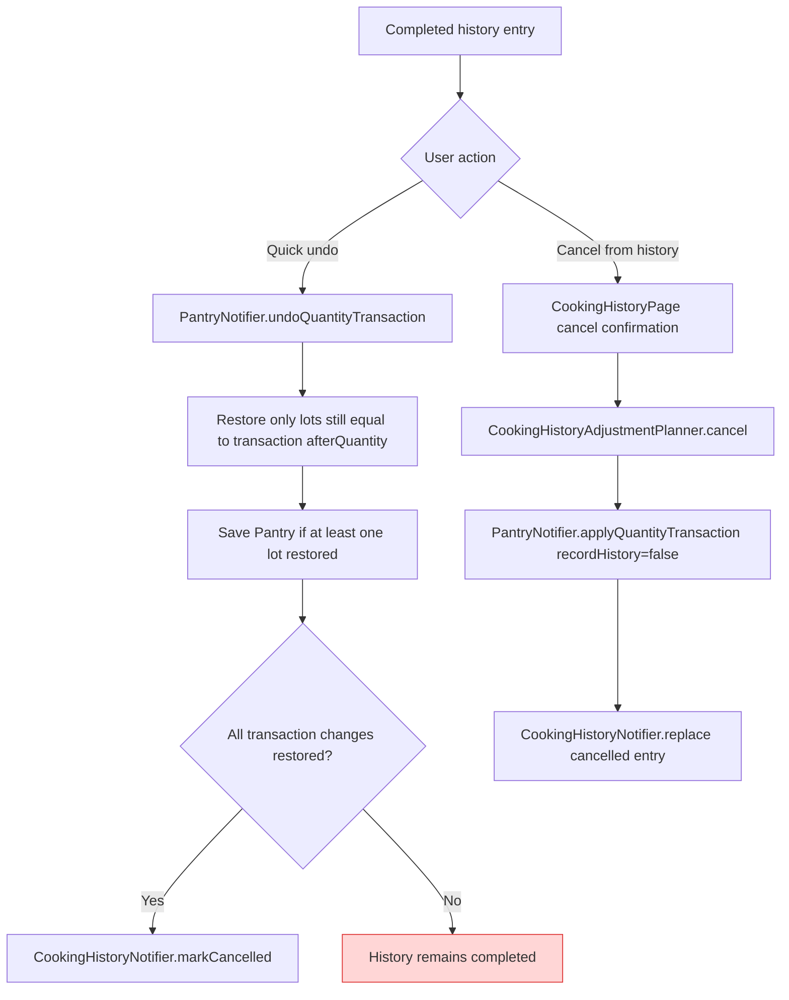
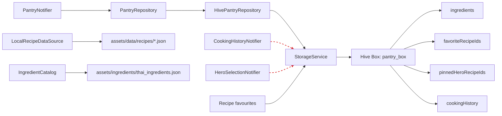
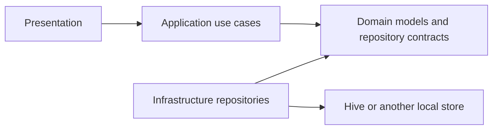

# KinRaiDee Dependency Graph

- Audit date: 2026-07-26
- Application commit: `d8631869bb7e0eb18a9cc136189006212f8737dd`
- Scope: current runtime dependencies and mutation paths, not the proposed target architecture

The diagrams below reflect observed imports and calls. Dashed red arrows mark dependencies that cross the intended boundary or couple a lower-level module to presentation or navigation.

## Application-wide dependency direction

Evidence:

- `apps/mobile/lib/features/recipe/presentation/providers/recipe_provider.dart:14-40` wires the recipe data source, repository implementation, and provider.
- `apps/mobile/lib/core/providers/pantry_provider.dart:3-10` imports app navigation, a Pantry repository implementation, Pantry domain types, a presentation provider, and `StorageService`.
- `apps/mobile/lib/features/pantry/presentation/providers/cooking_history_provider.dart:3-12,76-81` calls `StorageService` directly.
- `apps/mobile/lib/features/recipe/presentation/providers/recipe_provider.dart:96-145` persists hero selections directly through `StorageService`.

The direction is not consistently `presentation -> application -> domain <- infrastructure`. There is no application layer, and `core/providers` depends upward on both `app` and feature presentation.

## Pantry flow

Evidence:

- `apps/mobile/lib/features/pantry/presentation/pages/pantry_page.dart:45-58,161-165` mutates through `PantryNotifier` and watches both Pantry and derived list state.
- `apps/mobile/lib/features/home/presentation/pages/home_page.dart:19` watches the entire Pantry collection.
- `apps/mobile/lib/features/recipe/presentation/providers/recipe_provider.dart:22-27,154-172` derives recipe results and recommendations from the entire Pantry collection.
- `apps/mobile/lib/features/pantry/data/repositories/hive_pantry_repository.dart:1-32` delegates Pantry persistence to `StorageService`.
- `apps/mobile/lib/core/services/storage_service.dart:31-37` rewrites the complete ingredient list under one Hive key.

## Recipe flow

Evidence:

- `apps/mobile/lib/features/recipe/data/datasources/local_recipe_datasource.dart:8-45` lists the nine bundled recipe packs.
- `apps/mobile/lib/features/recipe/data/repositories/local_recipe_repository.dart:1-14` implements the domain repository using that data source.
- `apps/mobile/lib/features/recipe/presentation/pages/recipe_detail_page.dart:74-166` performs serving, deduction, transaction, navigation, and snackbar orchestration.
- `apps/mobile/lib/features/recipe/domain/services/recipe_serving_calculator.dart` and `pantry_deduction_planner.dart` contain the pure calculation logic.

## Recommendation flow

Evidence:

- `apps/mobile/lib/features/recipe/presentation/providers/recipe_provider.dart:154-172` watches the complete Pantry and recipe collections before invoking recommendation logic.
- `apps/mobile/lib/features/recipe/domain/services/smart_recommendation_engine.dart` ranks candidates using matching and preference signals.
- `apps/mobile/lib/features/recipe/domain/services/recipe_matcher.dart` scans Pantry ingredients for each recipe.
- `apps/mobile/lib/features/recipe/presentation/providers/recipe_provider.dart:96-145` makes the presentation notifier the persistence owner for hero pins.

Any Pantry mutation can recompute matching and ranking across all 158 recipes. The app has no debouncing, incremental index, or selective Pantry projection for this path.

## Cooking-history flow

Evidence:

- `apps/mobile/lib/features/recipe/presentation/pages/recipe_detail_page.dart:74-166` builds and submits the transaction.
- `apps/mobile/lib/core/providers/pantry_provider.dart:219-257` saves Pantry before recording History and publishing navigation/feedback events.
- `apps/mobile/lib/features/pantry/presentation/providers/cooking_history_provider.dart:17-25,76-81` updates state and persists History separately.

## Undo and cancel flow

Evidence:

- `apps/mobile/lib/core/providers/pantry_provider.dart:260-301` restores matching items independently and cancels History only when every item restored.
- `apps/mobile/lib/features/pantry/presentation/pages/cooking_history_page.dart:72-99` applies a Pantry delta and then separately replaces the History entry.
- `apps/mobile/lib/features/pantry/domain/services/cooking_history_adjustment_planner.dart:58-97` computes the correction delta correctly but does not own persistence.
- `apps/mobile/test/core/providers/pantry_provider_test.dart:85-203` covers single-item undo cases, not a partial multi-item restore.

## Current persistence access paths

Evidence:

- `apps/mobile/lib/core/services/storage_service.dart:9-17` defines one dynamic box and the four logical keys.
- `apps/mobile/lib/core/services/storage_service.dart:31-37,139-146` persists Pantry and History as whole lists of raw maps.
- `apps/mobile/lib/features/pantry/presentation/providers/cooking_history_provider.dart:76-81` and `apps/mobile/lib/features/recipe/presentation/providers/recipe_provider.dart:96-145` bypass repository contracts.

## Target dependency constraint for Shopping

Shopping should not copy the direct-persistence paths shown above. Before implementation, the accepted dependency rule should be:

This is a constraint proposal only. No target-layer or Shopping implementation was added during the audit.
