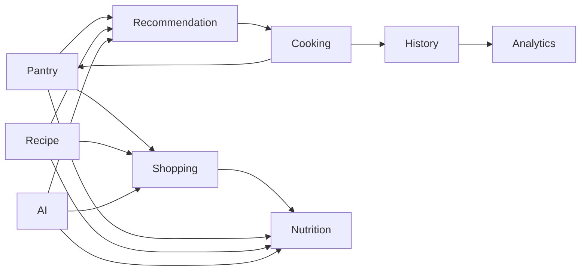

# Domain Model

KinRaiDee is organised around kitchen decisions rather than screens or database boxes.

## Core domains

### Pantry

Represents food currently available, including quantity, unit, expiry context, and state required for recommendation and cooking.

### Recipe

Represents cookable instructions, ingredient requirements, serving information, and metadata.

### Recommendation

Evaluates pantry and recipe information to suggest suitable meals, use-soon options, and ingredient coverage.

### Cooking

Coordinates a completed cooking action, including serving adjustments and pantry deduction.

### History

Stores the durable record of cooking activity and the information required to cancel or restore a transaction correctly.

### Shopping

Represents what should be acquired, why it is needed, its lifecycle, and its relationship to pantry and recipes.

### Nutrition

Provides nutritional interpretation after the Shopping domain is stable. It must not become a prerequisite for core offline cooking.

### AI

Uses approved tools and application services to reason across domains. AI is not a persistence owner and cannot bypass business rules.

## Relationship rules

- Pantry and Recipe may be read by Recommendation.
- Cooking may mutate Pantry only through approved application and repository boundaries.
- History must retain enough information to reverse or explain a cooking action.
- Shopping may derive candidates from pantry gaps or user intent, but must not deduct pantry quantities.
- AI calls domain tools; it does not own domain data.
