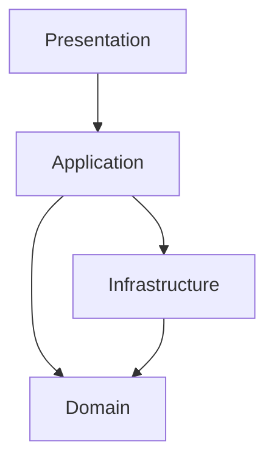

# Package and Dependency Rules

These rules describe allowed dependency direction. The physical source tree may differ and must be verified before refactoring.

## Allowed

- Presentation depends on application-facing APIs and state providers.
- Application orchestrates domain behaviour and repository interfaces.
- Domain contains business concepts and must remain independent of Flutter and Hive.
- Infrastructure implements repository interfaces and platform integrations.

## Forbidden

- UI widgets directly reading or writing Hive.
- Domain entities importing Flutter widgets, Riverpod providers, or storage adapters.
- Infrastructure defining business policy that belongs in the domain.
- AI code bypassing application services to mutate storage.
- Circular dependencies between feature modules.

## Feature boundaries

- Prefer a clear feature boundary over shared global utilities.
- Move code into shared/core only when at least two features genuinely require the same stable abstraction.
- Do not create generic abstractions before concrete duplication and requirements exist.
- Cross-feature mutations should be coordinated by an application service, not by one feature reaching into another feature's storage.

## Refactoring rule

A package or folder restructure requires:

- a written motivation;
- impact analysis;
- migration plan;
- passing tests;
- no unrelated feature behaviour changes.
