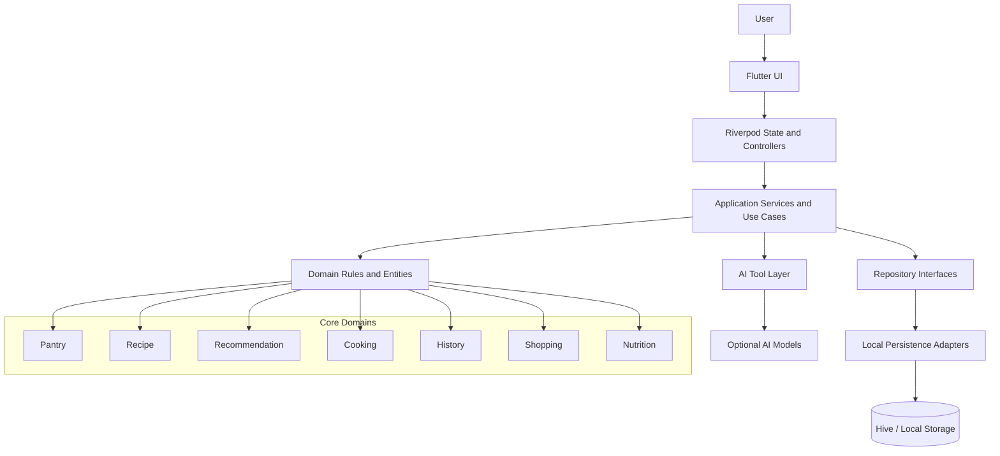
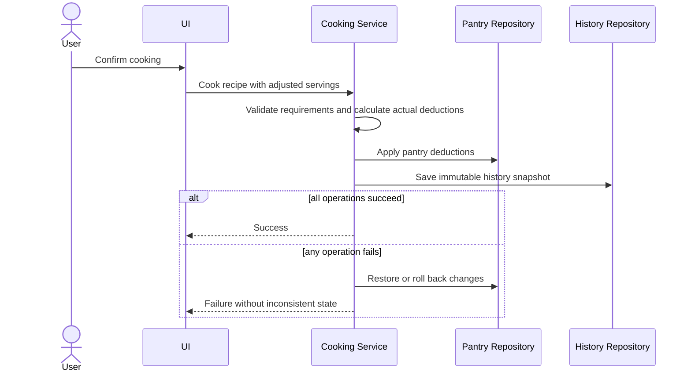

# System Diagram

## Runtime principles

- Core workflows run locally without network access.
- Flutter UI communicates with application-facing state and use cases.
- Business rules remain independent from UI and storage technology.
- Repositories isolate persistence details.
- AI is optional and interacts through explicit tools.
- Future cloud services must complement, not replace, local operation.

## Cooking transaction flow

