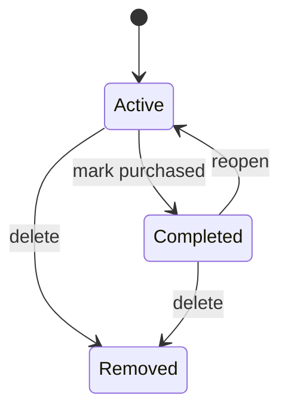

# Shopping Foundation — Feature Specification

**Status:** Proposed

**Owner:** CTO

**Implementer:** Codex

## Problem

KinRaiDee can tell users what they have and what they can cook, but it does not yet provide a first-class workflow for what they need to buy.

## Goal

Create an offline-first Shopping domain that can hold manually added items and future recipe- or pantry-derived candidates without coupling the feature directly to UI or Hive.

## In scope

- Shopping item domain model
- Shopping item lifecycle
- Local repository interface and implementation
- Add, edit, complete, reopen, and remove actions
- Manual items
- Source/reason metadata designed for future generated candidates
- Unit and quantity validation
- State management and basic UI
- Automated tests

## Out of scope

- Automatic pantry addition after purchase
- Nutrition calculations
- Cloud sync
- Household sharing
- Receipt scanning
- Generative-AI shopping actions
- Price comparison or retailer integrations

## Proposed lifecycle

## Required business rules

- Shopping actions do not deduct pantry quantities.
- A shopping item can be manual or generated, and its origin remains identifiable.
- Completion does not modify pantry unless a future approved specification adds that behaviour.
- Quantity and unit combinations must be validated.
- Repeated commands must not create duplicate state transitions.
- Persistence is accessed through repositories, never directly from UI.

## Acceptance criteria

- Users can create a shopping item offline.
- Users can edit an active item.
- Users can mark an item completed and reopen it.
- Users can remove an active or completed item.
- State survives application restart.
- UI does not access Hive directly.
- Domain and repository behaviour have automated tests.
- Existing pantry, recipe, recommendation, cooking, and history tests remain green.
- Handbook feature inventory and current-state documents are updated when implementation is merged.

## Open decisions before coding

- Final field schema and identifiers
- Duplicate-item policy
- Unit normalisation strategy
- Whether removed items are soft-deleted or permanently deleted
- Ordering and grouping rules
- Minimum supported UI scope

Codex must not implement until these open decisions are resolved or explicitly delegated in an approved ADR/RFC.
