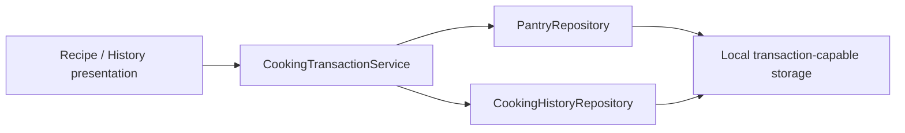

# KinRaiDee Architecture Readiness Refactor Proposal

- Audit date: 2026-07-26
- Application commit: `d8631869bb7e0eb18a9cc136189006212f8737dd`
- Constraint: preserve current product behavior; do not implement Shopping in this work

## Objective

Establish a safe, reviewed base for Shopping Foundation without a large architecture rewrite. The proposal targets only the proven blockers in `ARCHITECTURE_REVIEW.md` and keeps the well-tested matching, serving, deduction, recommendation, and history-delta algorithms intact.

## Required before Shopping

### 1. Establish the approved source baseline

The audited branch `feature/cooking-history-4.8.1` at `d8631869` is 176 commits ahead of `main` at `b27e1762` and has no pull request. The branch includes the active transaction and History code in:

- `apps/mobile/lib/core/providers/pantry_provider.dart`
- `apps/mobile/lib/features/pantry/presentation/pages/cooking_history_page.dart`
- `apps/mobile/lib/features/recipe/presentation/pages/recipe_detail_page.dart`
- their provider, planner, and test files

Action:

1. Open and review the current application branch.
2. Resolve review findings without adding Shopping.
3. Make analysis, formatting, and the full test suite green.
4. Record the approved base commit for Shopping.

Exit criteria:

- A reviewed source PR exists and is merged or explicitly designated as the base.
- `flutter analyze`, `flutter test`, and formatter verification pass.

### 2. Create one cooking transaction application boundary

Current evidence:

- Completion saves Pantry then History (`pantry_provider.dart:248-253`).
- Adjustment/cancel saves Pantry then replaces History (`cooking_history_page.dart:89-99`).
- Quick undo saves Pantry then conditionally cancels History (`pantry_provider.dart:292-298`).

Proposed narrow shape:

Required behavior:

- Validate every transaction change before any state mutation.
- Use an explicit transaction ID and idempotent operation.
- Commit Pantry and History atomically where the store supports it, or use a durable journal with recovery/compensation.
- Return a typed success/failure result.
- Never navigate or show snackbars from the application service.

Required tests:

- second write fails after the first;
- restart after an interrupted transaction;
- repeated transaction ID;
- missing, changed, deleted, or unit-mismatched Pantry lot;
- multi-item apply where one precondition fails;
- multi-item undo where one lot changed after cooking;
- adjustment and cancellation failure recovery.

This extraction should reuse `PantryDeductionPlanner` and `CookingHistoryAdjustmentPlanner`; it should not rewrite their calculation logic.

### 3. Approve shared identity and unit contracts

Current evidence:

- Pantry lot has only free-text name plus lot ID (`core/models/ingredient.dart:1-42`).
- Pantry `FoodItem` has no stable ID (`food_category.dart:13-38`).
- Recipe requirements use IDs but matching still relies on names (`ingredient_name_matcher.dart:3-56`).
- units are strings across Pantry, recipe requirements, transactions, and History.

Decisions required:

- canonical ingredient vs variant vs Pantry lot identity;
- mapping of 104 Pantry picker items to the 57-entry recipe taxonomy;
- unknown/custom ingredient policy;
- quantity dimensions, canonical units, precision, and conversion failures;
- duplicate and aggregation semantics for Pantry and future Shopping;
- schema migration and rollback plan.

Exit criteria:

- ADR-003 repository boundaries, ADR-004 transaction safety, and ADR-005 Shopping domain are accepted or replaced by accepted decisions.
- `docs/04_Product_Specs/Shopping.md` unresolved identity, duplicate, unit, delete, ordering/grouping, and scope decisions are closed.

### 4. Add repository boundaries for all durable mutable data

Current direct persistence:

- `CookingHistoryNotifier` -> `StorageService` (`cooking_history_provider.dart:3-12,76-81`).
- `HeroSelectionNotifier` -> `StorageService` (`recipe_provider.dart:96-145`).

Action:

- Add a domain-owned `CookingHistoryRepository` and local implementation.
- Put pinned/favourite preference persistence behind a small injected repository if it remains durable.
- Keep `StorageService` as infrastructure temporarily; do not replace Hive merely to satisfy layering.
- Add a dependency rule/check preventing presentation imports of Hive and `StorageService`.

Exit criteria:

- No presentation provider or page calls Hive/`StorageService`.
- Fakes can inject read/write failures into all transaction tests.

### 5. Stabilize time, error, and completion behavior

Action:

- Inject or pass `now` through expiry-sensitive calculations; fix `pantry_deduction_planner_test.dart:11-60`.
- Select one completion-feedback owner. Remove the double snackbar path across `MainShell` (`main_shell.dart:35-62`) and `RecipeDetailPage` (`recipe_detail_page.dart:153-166`) while preserving one tested undo affordance.
- Represent persistence failures to callers and restore/retain consistent Riverpod state.
- Add widget tests for completion -> Pantry -> undo and History adjustment/cancel.

Exit criteria:

- Full suite is deterministic and green on more than one calendar date.
- Failure paths leave Pantry and History consistent.
- Exactly one completion feedback event is visible.

## Recommended during Shopping

These changes belong in the Shopping implementation because they define the new feature boundary, not because the existing app needs a broad refactor.

### Shopping domain and application layer

- Create first-class Shopping domain entities only after the identity/unit ADRs are accepted.
- Define repository contracts in the Shopping domain and local implementations in data/infrastructure.
- Use application use cases for manual add/edit/check/delete, recipe-shortage generation, and Shopping-to-Pantry transfer.
- Keep widgets free of Hive serialization and cross-feature mutation sequencing.
- Model fallible mutations with typed results or Riverpod `AsyncValue` at the boundary.

### Integration contracts

- Consume canonical ingredient IDs and quantity values from the approved shared model.
- Make recipe-shortage generation a pure, tested calculation from recipe requirements and Pantry availability.
- Make Shopping-to-Pantry transfer an idempotent transaction with a source/cause and transaction ID.
- Define explicit event/result contracts for post-transfer navigation and feedback.

### Storage

- Add a versioned Shopping schema and migration fixtures.
- Prefer a repository query boundary that can later support ordering/grouping and pagination.
- Keep Hive if it satisfies the approved transaction/recovery contract; storage replacement is not a prerequisite by itself.

## Safe to postpone

### Page decomposition unrelated to transaction safety

`RecipeDetailPage`, `RecipePage`, `PantryPage`, and `CookingHistoryPage` are large, but only workflow extraction is required now. Split visual sections incrementally when they are touched by an approved feature.

### Recommendation optimization

`smartRecommendationProvider` watches full Pantry and recipe lists (`recipe_provider.dart:154-172`) and scans 158 recipes. Profile after Shopping adds realistic data. Selective watches, cached indexes, or background computation can wait until a measured threshold is exceeded.

### Whole-list storage optimization

`StorageService.saveIngredients` and `saveCookingHistory` rewrite lists (`storage_service.dart:31-37,139-146`). Introduce repository paging/query contracts now, but defer per-record migration until expected history volume or profiling demonstrates need.

### Typography offline hardening

Bundle Google Fonts or disable runtime fetching in `app_theme.dart:1-25`. This improves deterministic offline rendering but does not block the core Shopping domain once higher risks are closed.

### Naming cleanup

Rename Pantry `Ingredient`, canonical Recipe `Ingredient`, and `RecipeIngredient` only after the identity decision. A rename before the model contract would create churn twice.

## Do not refactor yet

### Do not replace Riverpod globally

Riverpod provider overrides already support useful unit tests in `pantry_provider_test.dart` and `pantry_completion_navigation_test.dart`. Fix fallible mutation boundaries and broad watches selectively.

### Do not replace Hive solely for architectural appearance

The problem is transaction/recovery semantics and unversioned access, not the Hive brand. First prove whether a single-box transaction, journal, or repository-level compensation meets the accepted ADR.

### Do not reorganize the entire folder tree

Moving files from `core` to feature folders without changing ownership would obscure history and create merge risk. Extract the one application service and repository contracts required by evidence.

### Do not rewrite tested domain algorithms

`RecipeMatcher`, `RecipeServingCalculator`, `PantryDeductionPlanner`, `SmartRecommendationEngine`, `PantryExpiryPriority`, and `CookingHistoryAdjustmentPlanner` have strong unit coverage. Wrap them behind safer workflows; do not redesign their outputs without a separate product requirement.

### Do not add cloud synchronization, AI, or remote APIs

The application is currently local-first through Hive and bundled assets. Shopping Foundation should prove its local domain, migration, and transaction behavior before any remote concern is introduced.

### Do not implement Shopping from this audit branch

This branch documents findings only. No Shopping model, repository, provider, schema, or UI should be added until the required gates are closed.

## Recommended next sprint

1. Reconcile the current source branch and make all automated gates green.
2. Approve transaction, repository, identity, and unit decisions.
3. Implement the narrow cooking transaction boundary with failure/restart tests.
4. Remove direct persistence from presentation and consolidate completion feedback.
5. Rerun the readiness audit; begin Shopping only if the verdict changes from **NOT READY**.
