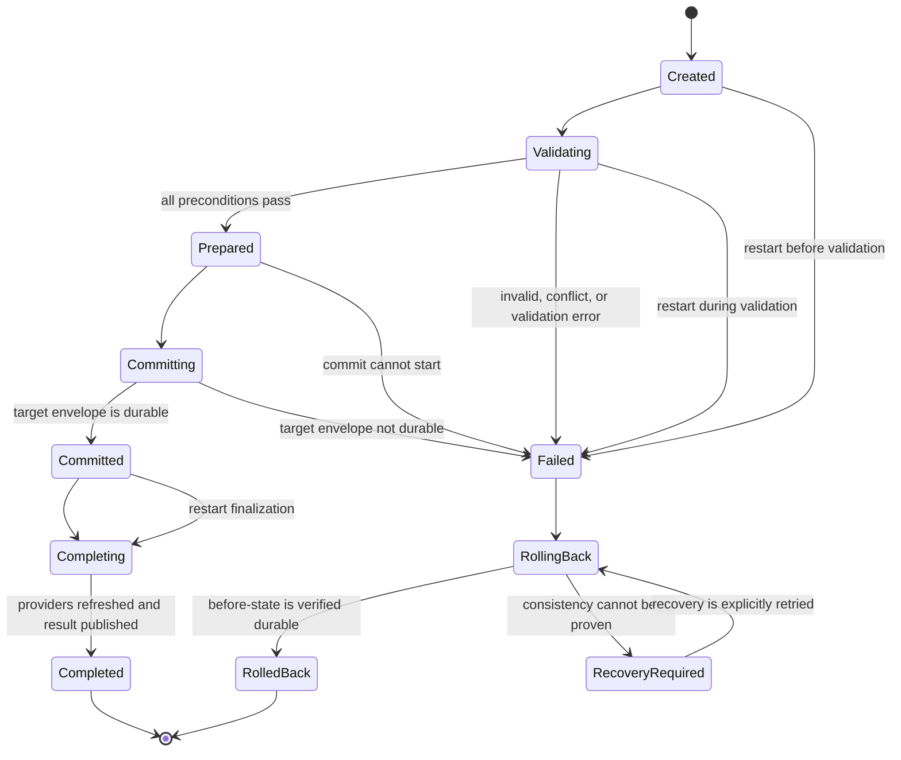
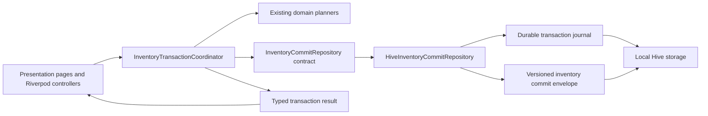
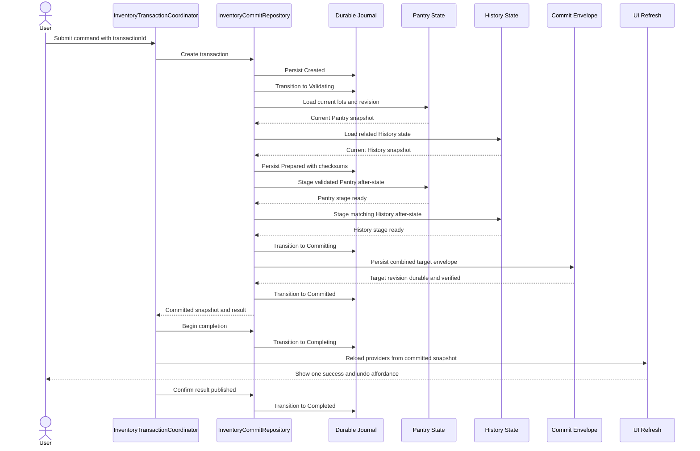
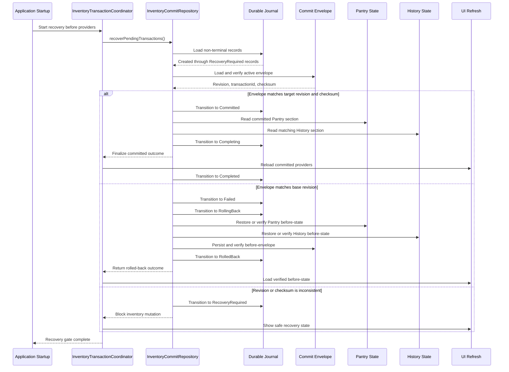
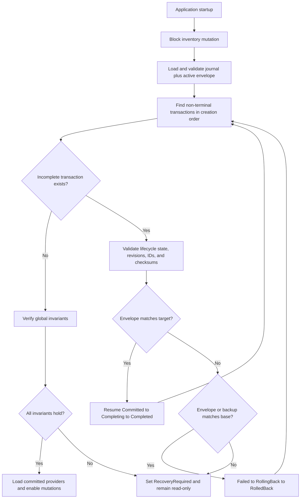

# RFC-0003: Transaction Safety & Inventory Consistency

- Status: Draft
- Review status: Request changes addressed; pending CTO re-review
- Author: Principal Software Engineer
- Reviewers: CTO, Flutter Lead, Pantry Domain Owner, Persistence Owner, QA
- Created: 2026-07-26
- Target milestone: Architecture Readiness before Shopping Foundation
- Related decisions: ADR-003, ADR-004, ADR-005
- Source evidence: KinRaiDee `feature/cooking-history-4.8.1` at `d8631869bb7e0eb18a9cc136189006212f8737dd`
- Architecture audit: `docs/02_Architecture/ARCHITECTURE_REVIEW.md`

## Summary

KinRaiDee must treat inventory-affecting operations as one recoverable business transaction. Cooking completion, cooking-history adjustment, cancellation, quick undo, and future Shopping-to-Pantry transfer must either commit a complete, durable outcome or leave the previous durable state unchanged.

This RFC proposes:

1. one `InventoryTransactionCoordinator` application boundary;
2. explicit, locally generated transaction IDs;
3. all-or-nothing precondition validation;
4. a storage-agnostic `InventoryCommitRepository`;
5. a versioned inventory commit envelope;
6. a durable transaction journal for idempotency and restart recovery;
7. UI state updates only after the durable commit succeeds;
8. all-or-nothing quick undo.

The first implementation may continue using Hive. This RFC does not approve Shopping implementation or require a storage-engine replacement.

## Context and evidence

The architecture audit found three critical consistency violations.

### Separate Pantry and History writes

`PantryNotifier.applyQuantityTransaction` updates Riverpod state, saves Pantry, and only then records Cooking History (`apps/mobile/lib/core/providers/pantry_provider.dart:248-253`).

`CookingHistoryPage._applyAdjustment` also saves Pantry before replacing the History entry (`apps/mobile/lib/features/pantry/presentation/pages/cooking_history_page.dart:89-99`).

Quick undo saves Pantry before it marks History cancelled (`apps/mobile/lib/core/providers/pantry_provider.dart:292-298`).

An exception or application termination between these writes can produce:

- deducted Pantry with no History entry;
- restored Pantry with completed History;
- adjusted Pantry with stale History;
- a retry that applies the operation twice.

### Missing transaction preconditions

`PantryNotifier.applyQuantityTransaction` maps changes by Pantry lot ID and assigns `afterQuantity` (`pantry_provider.dart:228-246`) without proving that:

- every referenced lot still exists;
- every current quantity still equals the planned `beforeQuantity`;
- units still match;
- change IDs are unique;
- no other inventory transaction has committed since planning.

A stale transaction can overwrite a later user edit.

### Partial quick undo

`undoQuantityTransaction` restores every independently eligible lot and saves the partial result (`pantry_provider.dart:260-293`). History is cancelled only when every change is restored (`294-298`).

A multi-lot transaction can therefore partially restore Pantry while its History entry remains completed. Current tests at `apps/mobile/test/core/providers/pantry_provider_test.dart:85-203` cover only single-change transactions.

## Transaction State Machine

Every accepted transaction exists in exactly one state. State transitions are serialized by `InventoryTransactionCoordinator`; no caller may assign a state directly.



### State definitions

| State | Meaning | Durable mutation allowed? | Valid next states |
|---|---|---:|---|
| `Created` | Coordinator accepted a command and assigned/validated its globally unique transaction ID. | No | `Validating`, `Failed` |
| `Validating` | Command, snapshot revision, History eligibility, and every lot precondition are being checked. | No | `Prepared`, `Failed` |
| `Prepared` | Validation passed and the durable journal contains checksummed before/after intent. | No business-state mutation yet | `Committing`, `Failed` |
| `Committing` | Repository is persisting the target commit envelope. | Yes, but it must remain invisible to presentation until verified | `Committed`, `Failed` |
| `Committed` | Target envelope, revision, transaction ID, Pantry, and History are verified durable. | Already durable | `Completing` |
| `Completing` | Providers are loading the committed snapshot and presentation result is being published. | No additional business mutation | `Completed` |
| `Completed` | Durable result has been published. This is a successful terminal state. | No | None |
| `Failed` | Validation or commit failed and success cannot be reported. This is not terminal. | No new forward mutation | `RollingBack` |
| `RollingBack` | Repository is restoring or verifying the journal before-state. | Restoration only | `RolledBack`, `RecoveryRequired` |
| `RolledBack` | Before-state is verified durable. This is a failed terminal state. | No | None |
| `RecoveryRequired` | Repository cannot prove either target or before-state consistency. Inventory is fail-closed/read-only. | Recovery only | `RollingBack` after an explicit recovery attempt |

### State transition rules

- A transition must compare the journal's current state before writing the next state.
- No state may transition directly to itself to simulate progress.
- `Completed` and `RolledBack` are terminal and immutable.
- A `Committed` transaction can never transition to `Failed` or `RolledBack`; restart recovery must finish it through `Completing`.
- `Failed` is an intermediate failure state. It must reach `RolledBack` or `RecoveryRequired`.
- `RecoveryRequired` blocks Pantry, History, undo, cancel, and future Shopping mutation until resolved.
- A command that crashes before its initial journal record is durable has no durable transaction identity and cannot have changed business state.
- Undo, cancel, and adjustment are new transactions with their own lifecycle; they reference but do not change the terminal state of the original transaction.

## User problem

Users trust Pantry quantities to describe food they currently own. A cooking action, cancellation, or undo that partially succeeds makes recipe availability and future Shopping recommendations incorrect.

The user cannot safely diagnose whether:

- cooking deducted all intended ingredients;
- cancellation restored the recorded quantities;
- undo restored only some lots;
- a failed or repeated action was already committed;
- an app restart completed or abandoned an interrupted operation.

The correct user-visible contract is simple: one action produces one complete outcome.

## Goals

- Make Pantry and Cooking History changes one logical, durable transaction.
- Reject the complete operation before mutation when any precondition fails.
- Make retries and repeated commands idempotent.
- Recover deterministically after termination between persistence steps.
- Preserve the exact historical quantity snapshots used by the original operation.
- Serialize overlapping local inventory mutations.
- Keep presentation, navigation, and snackbars outside the transaction service.
- Represent validation, conflict, storage, and recovery outcomes explicitly.
- Provide a safe transaction boundary for future Shopping-to-Pantry transfer.
- Remain fully functional offline.
- Add fault-injection, restart, and multi-item consistency tests.

## Non-goals

- Implementing Shopping or any other new product feature.
- Replacing Hive solely to obtain a different architecture.
- Adding cloud synchronization or multi-device conflict resolution.
- Redesigning recipe matching, serving calculations, deduction planning, or recommendation ranking.
- Defining canonical ingredient identity or unit conversion policy; those require separate accepted decisions.
- Reorganizing the complete Flutter project or rewriting all Riverpod providers.
- Building a general-purpose distributed transaction framework.
- Changing current user-visible quantity or cancellation rules without product approval.

## Transaction Invariants

The implementation must enforce the following invariants.

### INV-01: Exactly one transaction state

Every accepted transaction is in exactly one state from the state machine. No journal record may contain two states, a missing state, or an unrecognized state.

### INV-02: Inventory never becomes negative

Every persisted Pantry quantity is finite and greater than or equal to zero. Invalid input is rejected; it is never silently clamped.

### INV-03: Transaction IDs are globally unique

Every accepted transaction has a globally unique ID within the KinRaiDee transaction namespace. Timestamp-only IDs are not sufficient. Reuse of an ID with different content is a consistency violation.

### INV-04: One cooking commit creates exactly one History entry

One committed `CompleteCookingCommand` creates exactly one originating Cooking History entry with the same transaction ID. A retry cannot create a second entry.

### INV-05: Pantry and History represent the same committed state

For a committed inventory transaction, Pantry and the corresponding History snapshot/update must both represent the same exact changes and revision.

### INV-06: Apply is all-or-nothing

Every changed Pantry lot and History precondition passes before mutation. The complete command commits or none of it does.

### INV-07: Undo executes at most once

Quick undo restores every original change exactly once or restores none. The original transaction may reference at most one committed undo transaction.

### INV-08: Cancel is idempotent

Cancelling an already cancelled History entry returns the existing cancellation outcome and never restores quantities again.

### INV-09: Historical snapshots are immutable evidence

Recipe edits, current serving changes, Pantry renaming, or catalogue changes cannot alter the exact before/after values used by undo, cancellation, or recovery.

### INV-10: UI state never leads durable state

Riverpod state, navigation, and success feedback update only after the durable transaction reaches `Committed`.

### INV-11: Recovery completes before inventory becomes mutable

Startup recovery reaches a safe terminal or `RecoveryRequired` state before Pantry, History, or future Shopping mutation controls become available.

### INV-12: One local writer owns inventory mutations

All quantity-affecting mutations are serialized through the transaction coordinator. Pages and presentation notifiers cannot write inventory persistence directly.

### INV-13: Revisions are monotonic

Every committed inventory envelope increments the durable revision exactly once. Revisions never decrease or reset during normal operation.

## Proposed user workflow

### Cooking completion

1. The user confirms cooking.
2. The UI displays an in-progress state and disables duplicate submission.
3. The coordinator validates the recipe snapshot and every Pantry change.
4. The coordinator commits Pantry and History as one recoverable operation.
5. Only after durable success does the UI navigate and display completion/undo feedback.
6. A conflict leaves Pantry and History unchanged and asks the user to review the updated Pantry.
7. A storage failure leaves the prior visible state unchanged and offers retry.

### Quick undo

1. The user selects undo for the committed cooking transaction.
2. The coordinator verifies the original transaction, History status, and every current Pantry lot.
3. If all changes remain undoable, one new undo transaction restores all quantities and marks the original History entry cancelled.
4. If any lot changed or disappeared, nothing is restored. The UI explains that quick undo is no longer safe and offers the History adjustment/cancellation flow.

### History adjustment or cancellation

1. The user confirms the adjustment or cancellation.
2. `CookingHistoryAdjustmentPlanner` calculates the exact delta from the stored snapshot.
3. The coordinator validates the complete delta.
4. Pantry and the updated History entry commit as one transaction.
5. Repeating the same command returns the existing result.

### Startup recovery

1. Local storage opens.
2. The transaction repository validates the active commit envelope.
3. Pending journal records are reconciled against envelope revision and applied transaction ID.
4. Recovery either finalizes a known commit, aborts a known uncommitted operation, or enters a safe recovery-required state.
5. Pantry and History providers load only after recovery completes.

## Proposed architecture



Dependency rules:

- Presentation may submit typed commands and render typed results.
- Presentation must not call Hive, `StorageService`, or multiple repositories to complete one workflow.
- Domain planners remain pure and do not persist.
- The application coordinator owns validation, serialization, idempotency, and operation sequencing.
- The infrastructure repository owns durable commit, journal, and recovery mechanics.
- Navigation and snackbars remain presentation responsibilities.

## Commit Sequence Diagrams

### Successful commit

Pantry and History below are logical sections of one target envelope. They must not become independently visible durable commits.



Success is not returned before the target envelope is durable and the journal is `Committed`. Failure to publish UI feedback after that point does not roll back committed data; restart recovery completes the presentation projection.

### Recovery after application restart



## Proposed components

### `InventoryTransactionCoordinator`

Application service responsible for:

- serializing inventory commands;
- loading the current inventory snapshot;
- validating command and state preconditions;
- invoking existing calculation/planner services;
- producing an immutable proposed commit;
- submitting the commit once to `InventoryCommitRepository`;
- mapping infrastructure results to typed application outcomes.

It must not:

- import Flutter widgets or navigation;
- show feedback;
- call Riverpod presentation notifiers;
- serialize Hive maps;
- silently clamp invalid domain inputs.

### `InventoryCommitRepository`

Storage-agnostic contract responsible for:

- loading the current consistent snapshot;
- durably committing a prepared inventory change;
- returning a previous outcome for an existing transaction ID;
- recovering incomplete local transactions;
- validating schema version, revision, and checksums;
- exposing a safe recovery-required outcome instead of silently dropping malformed data.

Illustrative contract:

```dart
abstract interface class InventoryCommitRepository {
  Future<InventorySnapshot> loadConsistentSnapshot();

  Future<InventoryCommitResult> commit(InventoryCommit commit);

  Future<InventoryRecoveryResult> recoverPendingTransactions();
}
```

Names and exact package locations are subject to implementation review. The behavioral contract is normative.

### Existing domain planners

The following pure services should remain the source of calculation rules:

- `PantryDeductionPlanner`;
- `CookingHistoryAdjustmentPlanner`;
- `RecipeServingCalculator`;
- relevant quantity/unit validation.

This RFC changes orchestration and durability, not their approved product calculations.

## Commands

Initial supported command types:

- `CompleteCookingCommand`;
- `UndoCookingCommand`;
- `AdjustCookingHistoryCommand`;
- `CancelCookingHistoryCommand`.

Future, after Shopping approval:

- `TransferShoppingItemsToPantryCommand`.

Each command must include:

- a stable `transactionId`;
- command kind and schema version;
- creation timestamp supplied by an injectable clock;
- actor/source, currently `localUser`;
- the expected inventory revision;
- the relevant recipe or History identity;
- immutable planned quantity changes;
- optional reference to the transaction being reversed or adjusted.

No persisted command may contain a callback, provider reference, widget state, or navigation instruction.

## Precondition validation

Validation occurs against one loaded snapshot before journal preparation.

For quantity changes:

- the transaction ID is non-empty and structurally valid;
- change list is non-empty;
- Pantry lot IDs are unique within the command;
- every referenced lot exists;
- current quantity equals expected `beforeQuantity` within the approved numeric tolerance;
- current unit equals the expected unit until canonical-unit rules are accepted;
- before and after quantities are finite and non-negative;
- the envelope revision equals the command's expected revision;
- the History entry exists and has an eligible status when adjustment, cancel, or undo requires it;
- a reversal has not already been committed;
- a transaction with the same ID and different content is rejected as corruption/conflict.

Validation failure writes no `Prepared` intent, Pantry, History, or success UI state. If a `Created`/`Validating` journal record already exists, it transitions through `Failed` and the no-op rollback path to `RolledBack`.

## Data model impact

### `InventoryStateEnvelope`

Proposed fields:

- `envelopeVersion`;
- `minimumReaderVersion`;
- `capabilities`;
- `revision`;
- `lastAppliedTransactionId`;
- `updatedAt`;
- serialized Pantry state;
- serialized Cooking History state;
- integrity checksum;
- reserved versioned section for future transaction participants.

Pantry and History remain separate domain concepts. The envelope is a physical commit unit, not permission to merge their domain ownership.

### `InventoryTransactionRecord`

Proposed fields:

- `transactionId`;
- `transactionVersion`;
- `commandVersion`;
- `kind`;
- exactly one `state` enum value;
- `baseRevision`;
- `targetRevision`;
- `createdAt`;
- `updatedAt`;
- command checksum;
- immutable before and after commit envelopes or sufficient restoration snapshots;
- failure/recovery code without user ingredient data in logs.

Transaction states:

- `created`;
- `validating`;
- `prepared`;
- `committing`;
- `committed`;
- `completing`;
- `completed`;
- `failed`;
- `rollingBack`;
- `rolledBack`;
- `recoveryRequired`.

The persisted value is one enum discriminator, never a list of flags. The repository rejects unknown or impossible transitions.

### `PantryQuantityTransaction`

Recommended additions:

- explicit `transactionId`;
- command kind/cause;
- expected envelope revision;
- optional `reversesTransactionId`;
- schema version.

### `CookingHistoryEntry`

Recommended additions:

- explicit originating `transactionId`;
- optional cancellation/adjustment transaction ID;
- schema version.

History identity must no longer rely only on `${createdAt.microsecondsSinceEpoch}_${recipeId}` as implemented at `apps/mobile/lib/features/pantry/domain/models/cooking_history_entry.dart:194-195`.

### Pantry lot concurrency

The envelope revision protects the complete local snapshot. Each quantity change also retains expected lot ID, quantity, and unit so conflicts are explainable and testable.

Canonical ingredient and unit identifiers remain outside this RFC, but accepted identity/unit decisions must be compatible with these preconditions.

## Versioning Strategy

### Transaction envelope version

Version 1 introduces:

- `envelopeVersion: 1` on `InventoryStateEnvelope`;
- `transactionVersion: 1` on `InventoryTransactionRecord`;
- a versioned command payload for each transaction kind;
- `minimumReaderVersion`;
- an integrity checksum calculated over canonical serialized business content;
- an optional `capabilities` list for additive behavior that older readers must not execute.

An envelope version describes the physical commit format. A transaction version describes journal/state-machine fields. A command-kind version describes its domain payload. They evolve independently.

### Revision evolution

- Legacy migration creates envelope revision `0`.
- Every successful business commit writes `targetRevision = baseRevision + 1`.
- A transaction may enter several lifecycle states, but only its business commit increments the envelope revision.
- Validation failure and rollback to an unchanged before-envelope do not consume an inventory revision.
- A rollback that must durably rewrite the before-envelope retains the verified base revision and records the rollback only in the journal.
- Revisions are unsigned monotonic integers within one local inventory store.
- A stale base revision is a conflict; the coordinator must reload and replan rather than overwrite.
- Migration to a new envelope schema preserves the business revision and records a separate migration identifier.

### Compatibility policy

| Reader/writer condition | Required behavior |
|---|---|
| Same supported version | Read, validate checksum, and operate normally. |
| Older reader sees a newer `envelopeVersion` | Fail closed and enter read-only upgrade-required state; never rewrite or downgrade the envelope. |
| Newer reader sees an older supported version | Run the ordered, tested migration chain before enabling mutation. |
| Unknown optional field in a supported version | Ignore for behavior only when the schema marks it additive; preserve it during round-trip serialization where required. |
| Unknown transaction state or command kind/version | Enter `RecoveryRequired`; never guess a transition. |
| Missing required field or checksum mismatch | Reject the payload and attempt validated recovery/backup restoration. |

Forward compatibility means an older build preserves data and refuses unsafe mutation; it does not mean an older build must execute a newer transaction.

### Migration strategy

1. Keep immutable migration functions for every supported step, such as `legacy -> envelope v1` and later `v1 -> v2`.
2. Load and validate the source payload without modifying it.
3. Create a local backup and migration journal record with source version/checksum.
4. Transform deterministically and validate all invariants.
5. Persist the target envelope under its versioned format.
6. Re-open and verify version, revision, transaction references, and checksum.
7. Mark migration completed and enable mutation.
8. Retain the rollback source for the approved compatibility window.
9. Never dual-write two active schema versions.

Every supported migration requires fixtures for empty, normal, large, malformed, and previously migrated stores. Downgrade is allowed only through an explicit tested reverse migration; otherwise the older build remains read-only.

### Version retirement

A version can be retired only after:

- telemetry/error review shows no supported installations still require it, without collecting Pantry contents;
- forward and rollback windows have elapsed;
- fixtures remain available for long-term upgrade testing;
- the CTO approves removal.

## Durable Commit Protocol

The local implementation must use a documented three-stage protocol.

### Stage 1: Prepare

1. Load and validate the current envelope.
2. Reject a stale base revision.
3. Check whether the transaction ID already exists.
4. Build immutable before and after snapshots.
5. Transition the journal record from `Validating` to `Prepared` with base/target revision and checksums.
6. Re-read or otherwise satisfy the repository durability contract.

### Stage 2: Commit envelope

1. Transition the journal from `Prepared` to `Committing`.
2. Persist the complete target `InventoryStateEnvelope` as one versioned commit unit.
3. Include the transaction ID and incremented revision in that envelope.
4. Validate the durable envelope checksum and version.

The implementation must not save Pantry and History through separate presentation calls.

### Stage 3: Finalize

1. Transition the journal record to `Committed`.
2. Return one durable success result to the coordinator.
3. Transition to `Completing`.
4. Publish Riverpod state and user feedback from the committed snapshot.
5. Transition to terminal `Completed`.

If finalizing the journal marker fails after the envelope commits, startup recovery recognizes the target revision and transaction ID and finalizes the record without replaying quantities.

## Failure Matrix

The matrix is normative. "Pantry update" and "History update" include fault-injection points in an implementation that stages or physically writes sections separately. Such sections remain uncommitted until the complete target envelope and checksum are verified.

| Failure | Expected behavior | Recovery action | Data consistency guarantee |
|---|---|---|---|
| Crash before initial journal write | No durable transaction exists and no business data changes. The user may submit a new command with a new ID. | Load the unchanged base envelope; no transaction recovery is required. | Pantry and History remain at the previous committed revision. |
| Crash after `Created` or `Validating` journal write | No Pantry/History mutation is allowed. The record is incomplete. | Transition `Failed -> RollingBack -> RolledBack` using a verified no-op before-state. | No business-state change; the journal has one failed terminal outcome. |
| Crash after `Prepared` journal write | Intent and before/after checksums exist, but no target commit is assumed. | Compare the active envelope. Base match rolls back and marks `RolledBack`; target match resumes finalization; any other state becomes `RecoveryRequired`. | Exactly one of the verified base or target envelopes is selected; no guessed state. |
| Crash after Pantry update but before History update | No success is published. A separately durable Pantry section is treated as an illegal partial commit. | Use the prepared before-snapshot to restore Pantry and verify History at base revision, then mark `RolledBack`; if restoration cannot be proven, enter `RecoveryRequired`. | A completed/committed state can never expose changed Pantry with stale History. |
| Crash after History update but before commit finalization | No success is published. If the complete target envelope is durable, it is a committed-but-incomplete transaction; otherwise it is partial. | Matching target revision/checksum resumes `Committed -> Completing -> Completed`. Without a valid target envelope, restore both sections to the before-state and mark `RolledBack`. | Pantry and History finish together at target or together at base. |
| Crash after target envelope commit but before journal `Committed` | Durable business state contains the target transaction ID, but journal state is `Committing`. | Verify target revision/checksum and advance the journal to `Committed`, then `Completed`; do not replay quantities. | Exactly-once business commit with deterministic journal repair. |
| Duplicate retry | The same ID/checksum returns the existing terminal or recoverable outcome. No new transaction is created. | Recover if non-terminal; otherwise return `alreadyCommitted` or the recorded rollback/failure. | Quantities and History are not duplicated. |
| Duplicate commit request | Repository compares ID, checksum, and target revision before any write. | Matching committed target returns the original result; conflicting content enters `RecoveryRequired`. | One transaction ID maps to one immutable intent and at most one commit. |
| Duplicate undo | The original transaction already references its committed undo, or an undo is in progress. | Return `alreadyUndone` for the same intent; recover a non-terminal undo; reject a different second undo. | Original quantities are restored at most once. |
| Duplicate cancel | History already has a committed cancellation transaction or cancellation is in progress. | Return `alreadyCancelled`; recover the existing cancellation if non-terminal. | Cancellation never restores quantities twice. |
| App killed during commit | UI shows no success before restart. Journal/envelope may be at any non-terminal stage. | Startup recovery applies the state-specific rules before providers load. | UI never leads durable state; Pantry/History resolve to one verified revision. |
| Recovery after restart | Mutation controls remain disabled while all non-terminal records are reconciled in order. | Finalize a verified target, roll back to a verified base, or enter read-only `RecoveryRequired`. | No new inventory mutation occurs on top of an unresolved transaction. |
| Journal finalization write fails after commit | Durable target is valid but lifecycle state is behind. | Retry/finalize state transitions using target transaction ID and checksum. | Business changes are not replayed merely to repair metadata. |
| Rollback write or verification fails | Consistency cannot be proven. | Persist/retain `RecoveryRequired`, block mutations, and expose recovery UI/diagnostics. | The system fails closed rather than showing potentially inconsistent inventory. |
| Journal or envelope is corrupt | Payload cannot satisfy version/checksum/state invariants. | Restore from a validated backup/before-snapshot where possible; otherwise enter `RecoveryRequired`. | Corrupt data is never silently replaced with empty Pantry or History. |

## Recovery Algorithm

Startup recovery is a gate, not a background best-effort task. Providers may expose read-only recovery UI, but no inventory mutation is enabled until the algorithm completes safely.



### Startup recovery pseudocode

```text
recoverInventoryOnStartup():
    acquire exclusive inventory lock
    block Pantry, History, undo, cancel, and Shopping mutations

    journal = journalStore.loadAndValidateVersion()
    envelope = commitStore.loadAndValidateVersionAndChecksum()
    incomplete = journal.nonTerminalRecords()
                        .sortBy(createdAt, transactionId)

    for transaction in incomplete:
        assert transaction has exactly one recognized state
        assert transaction.transactionId is globally unique in journal

        if transaction.state in [Created, Validating]:
            transition(transaction, Failed)
            transition(transaction, RollingBack)
            verify envelope matches transaction.beforeRevision/checksum
            transition(transaction, RolledBack)
            continue

        if transaction.state in [Prepared, Committing]:
            if envelope matches transaction.targetRevision
               and envelope.lastAppliedTransactionId == transaction.transactionId
               and envelope.checksum == transaction.afterChecksum:
                if transaction.state == Prepared:
                    transition(transaction, Committing)
                transition(transaction, Committed)
                transition(transaction, Completing)
                publishSnapshotAfterLoop(envelope)
                transition(transaction, Completed)
                continue

            if envelope matches transaction.baseRevision
               and envelope.checksum == transaction.beforeChecksum:
                transition(transaction, Failed)
                transition(transaction, RollingBack)
                commitStore.persistAndVerify(transaction.beforeEnvelope)
                transition(transaction, RolledBack)
                envelope = transaction.beforeEnvelope
                continue

            if journal has a valid beforeEnvelope backup:
                transition(transaction, Failed)
                transition(transaction, RollingBack)
                restored = commitStore.restoreAndVerify(
                    transaction.beforeEnvelope,
                    transaction.baseRevision,
                    transaction.beforeChecksum
                )
                if restored:
                    transition(transaction, RolledBack)
                    envelope = transaction.beforeEnvelope
                    continue

            transition(transaction, Failed)
            transition(transaction, RollingBack)
            transition(transaction, RecoveryRequired)
            return RecoveryBlocked(transaction.transactionId)

        if transaction.state in [Failed, RollingBack]:
            if transaction.state == Failed:
                transition(transaction, RollingBack)

            if envelope matches transaction.baseRevision
               and envelope.checksum == transaction.beforeChecksum:
                commitStore.persistAndVerify(transaction.beforeEnvelope)
                transition(transaction, RolledBack)
                envelope = transaction.beforeEnvelope
                continue

            if journal has a valid beforeEnvelope backup:
                restored = commitStore.restoreAndVerify(
                    transaction.beforeEnvelope,
                    transaction.baseRevision,
                    transaction.beforeChecksum
                )
                if restored:
                    transition(transaction, RolledBack)
                    envelope = transaction.beforeEnvelope
                    continue

            transition(transaction, RecoveryRequired)
            return RecoveryBlocked(transaction.transactionId)

        if transaction.state in [Committed, Completing]:
            if envelope does not match transaction.targetRevision,
               transaction.transactionId,
               transaction.afterChecksum:
                return RecoveryBlocked(transaction.transactionId)
            if transaction.state == Committed:
                transition(transaction, Completing)
            publishSnapshotAfterLoop(envelope)
            transition(transaction, Completed)
            continue

        if transaction.state == RecoveryRequired:
            return RecoveryBlocked(transaction.transactionId)

        if transaction.state in [Completed, RolledBack]:
            continue

    verifyTransactionIdsAreUnique(journal)
    verifyRevisionsAreMonotonic(journal, envelope)
    verifyPantryQuantitiesAreFiniteAndNonNegative(envelope)
    verifyPantryAndHistoryConsistency(journal, envelope)
    verifyOneOriginHistoryPerCommittedCookingTransaction(journal, envelope)

    refresh Pantry and History providers from envelope
    enable inventory mutations
    release exclusive inventory lock
    return RecoveryComplete(envelope.revision)
```

Recovery must never guess by recalculating from current recipe data.

The application must not silently replace corrupt Pantry or History data with an empty collection.

## Idempotency Rules

`transactionId` is generated once at command creation and retained across retries.

### Transaction ID requirements

- Use a collision-resistant globally unique identifier suitable for offline generation, such as an approved UUID v4/v7 implementation.
- Do not generate IDs only from `DateTime.now`, recipe ID, list position, or device-local counters.
- Persist the ID before business-state mutation.
- Bind the ID to an immutable command checksum.
- Enforce uniqueness across active journal records, committed tombstones, undo, cancel, adjustment, and future Shopping transaction records.
- A collision with different content is `RecoveryRequired`, not a new attempt.

### Operation rules

| Operation | Existing state and identity | Expected outcome | Allowed writes |
|---|---|---|---|
| Retry | Same transaction ID and checksum; state `Created` through `Committing` | Resume validation/recovery from the recorded state. Do not create another record. | Only legal lifecycle/recovery transitions and the original target commit. |
| Retry | Same ID/checksum; state `Committed`, `Completing`, or `Completed` | Return the original committed result as `alreadyCommitted`; finish projection if needed. | Journal completion metadata only; no Pantry or History quantity write. |
| Retry | Same ID/checksum; state `Failed`, `RollingBack`, or `RolledBack` | Complete/return the recorded rollback result. A new user attempt requires a new ID and a newly planned command. | Rollback/finalization only. |
| Retry | Same ID with different checksum, kind, base revision, or reversal target | Reject as transaction identity conflict and enter `RecoveryRequired`. | Diagnostic/recovery metadata only; no business mutation. |
| Duplicate commit | Target envelope already contains the ID, target revision, and checksum | Return the original result and repair lagging journal state if necessary. | Journal state repair only. |
| Duplicate commit | Journal says committed but envelope does not match target | Enter `RecoveryRequired`; never replay automatically. | Recovery metadata only. |
| Duplicate undo | Original transaction has a committed `reversedByTransactionId` | Return `alreadyUndone` with the existing undo transaction ID. | None. |
| Duplicate undo | Same undo ID is non-terminal | Recover that undo transaction. | Original undo lifecycle/recovery only. |
| Duplicate undo | Different undo ID targets an already reversed transaction | Reject as `alreadyUndone`; do not restore again. | None. |
| Duplicate cancel | History has a committed `cancelledByTransactionId` | Return `alreadyCancelled` and the existing cancellation outcome. | None. |
| Duplicate cancel | Same cancel ID is non-terminal | Recover that cancellation transaction. | Original cancellation lifecycle/recovery only. |
| Duplicate cancel | Different cancel ID targets already cancelled History | Return `alreadyCancelled`; never restore quantities again. | None. |

Cancellation and undo reference the original transaction ID but are distinct transactions with globally unique IDs and their own state-machine lifecycles.

Retention and compaction policy is an open decision, but compaction must preserve idempotency tombstones for supported operations.

## Concurrency

Although the current app is local and single-user, asynchronous Flutter actions can overlap.

The coordinator must:

- allow only one inventory commit at a time;
- assign or validate a monotonic snapshot revision;
- reject a command planned from an older revision;
- disable duplicate UI submission while a command is pending;
- avoid holding widget/context references in the commit queue.

Cloud or multi-device conflict resolution is explicitly out of scope.

## Riverpod and presentation behavior

Presentation controllers should expose a typed async operation state such as:

- idle;
- submitting;
- committed;
- validation failure;
- conflict;
- storage failure;
- recovery required.

The exact Riverpod API is an implementation choice. A global Riverpod rewrite is not required.

Required behavior:

- do not update Pantry/History provider state before durable success;
- do not catch and discard storage errors;
- do not navigate from the transaction coordinator;
- maintain one completion-feedback owner;
- keep one tested undo action;
- reload provider state from the committed snapshot after recovery.

## Error model

Minimum typed outcomes:

- `committed`;
- `alreadyCommitted`;
- `validationFailure`;
- `conflict`;
- `storageFailure`;
- `recoveryRequired`;
- `cancelledBeforeCommit`.

Every failure includes a stable machine-readable code. User-visible messages must not expose stack traces or raw serialized data.

Unexpected errors must be logged with transaction ID, stage, revision, and error code, but not ingredient names or quantities.

## Offline behaviour

All proposed commands, validation, journal writes, recovery, and reads run locally.

- No network is required.
- Network availability cannot change commit semantics.
- Recovery works in airplane mode.
- A future remote synchronization layer must consume committed transactions after the fact and cannot become part of this local commit protocol without a separate RFC.

## Privacy, safety, and security

Pantry contents may reveal household behavior and should be treated as private local data.

- Transaction records remain local under the existing offline-first policy.
- Diagnostic logs use transaction IDs and error codes, not ingredient names or quantities.
- Corrupt or incompatible data must not be uploaded automatically.
- Recovery and migration retain a reversible local backup until validation succeeds.
- No AI model or external service receives transaction payloads.

## Performance considerations

The initial envelope approach rewrites Pantry and Cooking History together. This is acceptable only if benchmarked against representative local data.

Before release, define and test:

- expected maximum Pantry lots;
- representative and stress History sizes;
- commit latency on the minimum supported device;
- startup recovery latency;
- journal retention and compaction cost;
- memory impact while constructing before/after snapshots.

If the envelope fails the accepted performance budget, the implementation must return to RFC discussion and evaluate a transactional store. It must not fall back to unsafe separate writes.

## Alternatives considered

### Keep separate repositories and compensate on caught exceptions

Rejected as the primary design. Compensation can handle an exception in a running process but cannot close the termination window between Pantry and History writes.

### Use Hive `putAll` for multiple keys

Not selected without a proven durability and crash-recovery contract. A multi-key convenience API is not sufficient evidence of atomic business behavior.

### Use one envelope without a journal

Simpler, but insufficient for ambiguous completion, idempotent retry, before-state recovery, and diagnosing a corrupt or interrupted write.

### Replace Hive with SQLite, Isar, or another transactional database immediately

Deferred. A storage replacement is a larger migration and is unnecessary if the proposed repository contract can be proven on the current local store. The contract allows replacement later.

### Full event sourcing

Rejected for current scope. It provides a strong audit model but introduces replay, projection, compaction, and migration complexity beyond the current product needs.

### Allow partial quick undo

Rejected. Partial restoration without an explicit corresponding History state violates the user's mental model and the inventory consistency invariant.

### Update Riverpod state optimistically and roll back on failure

Rejected for cross-aggregate transactions. Rollback after process termination is impossible without durable recovery, and transient incorrect state can trigger recipe/recommendation recomputation.

## Acceptance criteria

### RFC review completeness

- The lifecycle defines every allowed success, failure, rollback, terminal, and recovery state.
- Every transaction has exactly one state and only legal transitions are permitted.
- Commit and restart-recovery sequence diagrams render successfully.
- The failure matrix covers every fault-injection point and all CTO-required crash/duplicate scenarios.
- Transaction invariants are explicit and testable.
- Startup recovery pseudocode resolves or blocks every non-terminal state.
- Retry, duplicate commit, duplicate undo, and duplicate cancel have unambiguous outcomes.
- Envelope, transaction, command, revision, forward-compatibility, and migration version rules are documented.

### Architecture

- One application service owns cooking completion, adjustment, cancel, and undo transaction sequencing.
- Presentation contains no direct Hive or `StorageService` access for those flows.
- `PantryNotifier` no longer coordinates History, navigation, and persistence for a cooking transaction.
- Domain planners remain pure and independently tested.
- Infrastructure implements `InventoryCommitRepository` with a documented durability contract.

### Consistency

- Pantry and History have no observable partial commit after an injected failure at any persistence stage.
- One committed cooking transaction creates exactly one originating History entry.
- Transaction IDs are globally unique and immutable.
- Inventory quantities are always finite and non-negative.
- A stale, missing, duplicated, unit-mismatched, or invalid change rejects the entire command.
- Quick undo restores all changes or none.
- Quick undo commits at most once.
- Cancel is idempotent.
- Repeated completion, cancellation, adjustment, and undo commands do not duplicate quantity changes.
- Recipe changes after cooking do not alter restoration values.

### Recovery

- Startup reconciles every supported interruption point.
- Recovery is deterministic from journal/envelope state and does not recalculate recipes.
- Corrupt or conflicting data produces `recoveryRequired`, not an empty Pantry/History fallback.
- Recovery runs offline.
- Every non-terminal lifecycle state has a restart test.

### UI and Riverpod

- UI state changes only after durable success.
- Duplicate submission is disabled while pending.
- Exactly one completion/undo feedback owner remains.
- Validation, conflict, storage, and recovery outcomes have user-visible handling.

### Quality gates

- `flutter analyze` passes.
- `dart format --output=none --set-exit-if-changed lib test` passes.
- Full `flutter test` passes deterministically.
- Fault-injection and restart tests pass.
- State-machine transition and illegal-transition tests pass.
- Version compatibility, migration, and downgrade-read-only tests pass.
- No existing Pantry, recipe, recommendation, History, cancel, or serving-calculation regression test is removed or weakened.
- Measured commit and recovery latency meet an approved device/data-volume budget.

## Testing strategy

### Unit tests

- command validation for every precondition;
- duplicate transaction ID with matching and mismatching checksum;
- all-or-nothing multi-lot apply;
- all-or-nothing multi-lot undo;
- repeated cancel/undo;
- quantity precision and invalid-number cases;
- revision conflicts;
- planner snapshot preservation.

### Repository contract tests

Run the same suite against fakes and the Hive implementation:

- prepare failure;
- envelope write failure;
- finalization failure;
- corrupt prepared record;
- corrupt active envelope;
- base/target/unknown revision recovery;
- re-open after every protocol stage;
- committed-result replay;
- migration from legacy keys.

### Provider and widget tests

- submitting/success/failure states;
- no optimistic Pantry or History mutation;
- completion -> Pantry -> undo;
- conflict -> no partial UI update;
- storage failure -> retry;
- startup recovery gate;
- one snackbar/feedback owner.

### Integration tests

- terminate/reopen after prepare;
- terminate/reopen after envelope commit;
- terminate/reopen before journal finalization;
- multi-item cooking and cancel;
- edit one lot before quick undo;
- recipe changes after History creation;
- legacy-data migration and rollback.

### Manual validation

- airplane-mode first launch;
- app background/termination during a transaction;
- low-storage error path where the platform permits simulation;
- representative large Pantry/History dataset;
- accessibility and Thai error-message review.

## Rollout and migration

### Phase 0: Contract and fault-injection harness

- Accept the relevant ADRs or replacements.
- Add repository fakes and durability contract tests.
- Fix the current time-dependent test and formatting gate.
- Do not change production behavior.

### Phase 1: Versioned storage and migration

1. Read legacy `ingredients` and `cooking_history` keys from `pantry_box`.
2. Validate and serialize them into `InventoryStateEnvelope` version 1.
3. Write and re-read the new envelope.
4. Treat a valid envelope as the activation marker.
5. Retain legacy keys unchanged for one rollback window.
6. After activation, do not dual-write legacy and new state.
7. On migration failure, preserve legacy data and enter an observable safe failure path.

### Phase 2: Coordinator behind existing workflows

- Route completion, adjustment, cancel, and undo through the coordinator.
- Keep current user-visible product rules.
- Remove the old separate-write paths only after integration tests pass.

### Phase 3: Stabilization

- Monitor local error codes and recovery counts without recording Pantry contents.
- Validate performance budgets.
- Perform a rollback drill.
- Close critical architecture audit findings only with test evidence.

### Rollback

Before any post-migration mutation, the original legacy keys remain available for a rollback build.

After the new envelope has accepted mutations, rollback must use a tested reverse migration or retain the new implementation. A rollback must never overwrite newer envelope data with stale legacy keys.

## Implementation sequence

1. Accept/revise this RFC and write ADR-004.
2. Define transaction/result/envelope/journal models.
3. Define `InventoryCommitRepository` contract and fault-injection suite.
4. Implement legacy migration and Hive repository behind tests.
5. Implement startup recovery gate.
6. Implement coordinator and precondition validation.
7. Route cooking completion.
8. Route adjustment and cancellation.
9. Route all-or-nothing quick undo.
10. Consolidate Riverpod state and completion feedback.
11. Run full regression, restart, migration, and performance tests.
12. Rerun the Shopping architecture-readiness gate.

## Open questions

- What proof threshold must the Hive envelope/journal spike satisfy before a transactional database alternative is required?
- Should journal and envelope use the existing `pantry_box` or a dedicated versioned box?
- What is the minimum supported device and approved commit/recovery latency budget?
- How long must committed transaction tombstones be retained?
- What is the History retention/archival policy?
- When a Pantry lot was deleted after cooking, should explicit cancellation recreate it or return a conflict?
- What numeric tolerance is approved for quantity preconditions before canonical quantity types exist?
- Which accepted ADR will own canonical ingredient and unit identity?
- Should every manual Pantry quantity edit use the same transaction ledger in the first release, or in a follow-up phase?
- What local recovery UX is approved when both envelope and journal validation fail?

## Decision

Pending CTO and engineering review.

Approval of this RFC authorizes design and implementation planning for transaction safety only. It does not authorize Shopping implementation, a product-behavior change, or a storage-engine migration without the required review.
